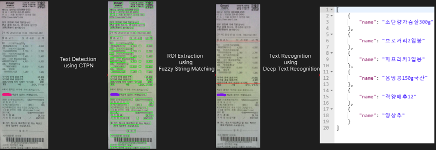

## 🔆 OCR Repository of Zero Fridge
**Zero Fridge** is an application which manages user's fridges by alarming of food subscription dates, and makes recording food bought easy by using the recipt OCR technology.  

**✔️ This is the repository for the OCR flow; containing of `Text Detection`, `Text Recognition`, and `Key Information Extraction`.**  

### `1. Directory Structure`
```
MAIN_REPO
|__ src
    |__ fridgeyocr
        |__ text_detection
        |__ text_recognition
        |_ __init__.py
        |_ detection.py
        |_ recognition.py
        |_ gdrive_utils.py : Functions to 
        |_ data_parse.py
        |_ data_parse_distance.py
        |_ fridgeyocr.py
|_ app.py
|_ Dockerfile
|_ requirements.txt
|_ README.md


```
### `2. To Run Inference Of Our FridgeyOCR`
#### 1. Installation
Install using `pip`
```
cd [DIRECTORY OF REPOSITORY]
pip install -r requirements.txt
```
#### 2. Usage
You can test the OCR demonstration on your recipt image by running the `Flask` api.
```
python run.py
```
- The demo is available in `127.0.0.1:8080/model` if you wish to test the result via `Postman`.
- The demo is available in `127.0.0.1:8080/demo` if you wish to test the result by uploading the image via web.


### `3. Explanation on How it Works`


